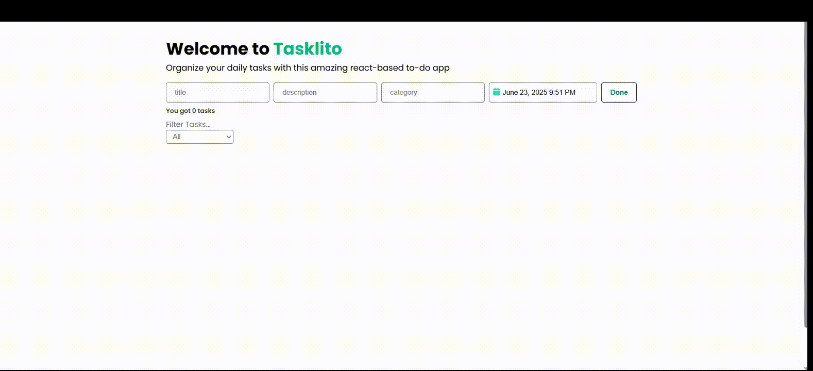

# Tasklito

A to-do list web app using react.js

## Description

A to-do list web app using react.js. Features includes CRUD operation on to-do's, filtering, modern UI, to-do's have categories, description and due-to, this project demonstrate my understanding on context api, managing global state, and enhancing rendering performance.

## Getting Started

### Dependencies

- [Vite](https://vitejs.dev/) Lightning-fast dev server and bundler
- [React](https://reactjs.org/) UI library for building components
- [Tailwind CSS](https://tailwindcss.com/) Utility-first CSS framework
- [Lucide React](https://lucide.dev/) Beautiful and consistent icon pack
- [React Datepicker](https://reactdatepicker.com/) Customizable date picker component

## Installing

To get the project up and running, following steps:

1. Download and install Node: <https://nodejs.org/>
2. Clone this repo: `git clone https://github.com/Mohamed-Maghraby/tasklito.git` (HTTPS)
3. Install project dependencies: `npm install`
4. Start the development environment: `npm run dev`
5. Open your browser and visit <http://localhost:port>

## Why this project?

This project helped me to understand how global state work and the performance effect on rendering. In this to-do app each to-do is an object
inside a state array in context. This context has a provider for consumer component, and since its and array all components consumes this context
get's re-rendered. that introduced me to more advanced technique on how to render tasks as user scroll, which is a feature to be implemented in
the future. Also as this project grows advanced state management libraries can be used as (zustand, redux) or even react-context-selector.
More about this is explained as a comment in src/context/TasksProvider.
This project is simple as it seems but it has a huge benefits on understanding of react core concept, absolutely shifted me more steps forward

## In Progress

- Switch to use-context-selector,
- Fix calender rendering issue when hover over days
- Implementing a Virtualization technique for list rendering using react-window (not necessary)
- Using a server-side & a database for storing to-do's instead of local storage (possibly IndexedDB)
- Sidebar for edit tasks
- WYSIWYG editor for task's description
- sub-tasks
- Image insertion support
- Connecting to Notion

## License

This project is licensed under the [MIT] License - see the LICENSE.md file for details
